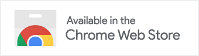
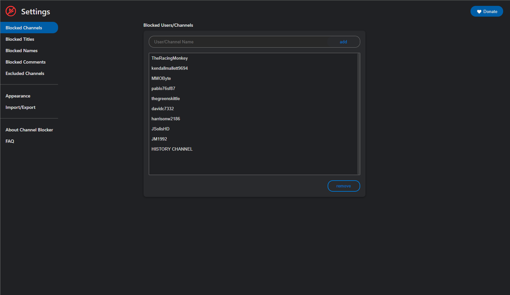

<p align="center"></p>

<h2 align="center"><b>Channel-Blocker</b></h2>

<p align="center">A web extension allowing you to block YouTube™ videos and comments by blacklisting users and/or by using regular expressions.</p>

<p align="center">
    <a href="https://chromewebstore.google.com/detail/channel-blocker/nfkmalbckemmklibjddenhnofgnfcdfp">
        
    </a>
    <a href="https://addons.mozilla.org/en-US/firefox/addon/youtube-cleaner/">
        
    </a>
</p>

---

### About this Extension

Our Add-on enables the function of blocking anything you'd like. Block separate videos, users or whole channels with only one click! Naturally, the add-on supports regular expressions to ensure you the best customization possible. And another thing: no user information is collected.

Do you like what we do? Do you want to support us and our work? A subscription on Patreon or a donation would help a lot at developing this tool as well as realizing our future projects.

### Screenshots

<p align="center">
    
    
    
    
</p>

---

## Getting Started

### Installation

Before you begin, ensure that you have [download and install Node.js and npm](https://nodejs.org/en/download/).

This project is composed of three npm projects: `content-scripts`, `service-worker` and `ui`.

To install all dependencies, simply run the following command:

```
./setup.sh
```

### Building the Extension

To build the web extension, simply run the following command:

```
./build.sh
```

This will create a `dist` folder that contains the web extension.
